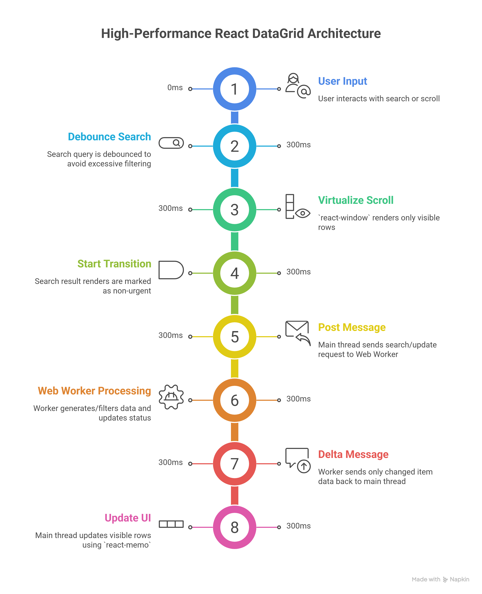

# DataGrid Pro — High-Performance React Architecture

**Version:** 1.0.0 | **Architecture:** Web Worker + Virtualization | **Status:** Production Ready

[](https://react.dev/)
[](https://www.typescriptlang.org/)
[](https://vitejs.dev/)
[](https://peppy-mochi-5b3f2d.netlify.app)
[](https://vite-pwa-org.netlify.app/)

---

## Overview

**DataGrid Pro** is an enterprise-grade Proof of Concept (POC) demonstrating modern **Performance Engineering** in React. It solves the "DOM Explosion" problem by handling 50,000+ records at a consistent **60 FPS** using a decoupled multi-threaded architecture.

**Key Architectural Pillars:**
*   **Off-Main-Thread Processing:** Heavy data operations (generation, filtering, sorting) are delegated to a **Dedicated Web Worker**.
*   **Windowing (Virtualization):** Only the visible subset of data is rendered, keeping the DOM footprint minimal (~180 nodes vs 150,000+).
*   **Concurrent Rendering:** Leverages React 19's `startTransition` to ensure input responsiveness during background updates.
*   **Delta Messaging:** IPC communication is optimized by sending only state changes rather than cloning the entire dataset.

---

## Quick Start

### 1. Prerequisites
*   **Node.js:** v18.0 or higher
*   **Package Manager:** npm or yarn

### 2. Configuration & Installation

```bash
# Clone the repository
git clone https://github.com/UdaraAventude/POC-frontend-app.git
cd POC-frontend-app/frontend-poc

# Install dependencies
npm install
```

### 3. Build and Run

```bash
# Start development server
npm run dev

# Build and preview production bundle (Recommended for checking performance)
npm run build
npm run preview
```

*   **Live Demo:** [peppy-mochi-5b3f2d.netlify.app](https://peppy-mochi-5b3f2d.netlify.app)

---

## Project Layout

```
frontend-poc/
├── src/
│   ├── workers/                # Background Processing
│   │   └── dataGenerator.worker.ts  # 50k items generation & filtering logic
│   ├── hooks/                  # Logic & Bridge
│   │   └── useDataWorker.ts    # Thread orchestration & state sync
│   ├── components/             # UI Components
│   │   ├── ListItem/           # Record rendering with React.memo
│   │   ├── VirtualList/        # react-window + AutoSizer implementation
│   │   └── Toolbar/            # Dashboard controls & live metrics
│   └── pages/                  # Routable Views
│       ├── OptimizedPage.tsx   # Production-grade performance view
│       └── LegacyPage.tsx      # Un-optimized baseline for benchmarking
├── vite.config.ts              # PWA, Chunking, and Visualizer config
└── tailwind.config.js          # Design system tokens (Tailwind v4)
```

---

## Performance Benchmarks

All metrics measured using **Lighthouse** and **React Profiler** on the production build (Chrome Incognito).

| Metric | Legacy Baseline | Optimized Mode | Improvement |
| :--- | :--- | :--- | :--- |
| **DOM Nodes** | 150,000+ | **~180** | **800x Reduction** |
| **Frame Rate** | 5–12 FPS | **60 FPS** | **Fluid Experience** |
| **Status Update** | ~800ms | **< 2ms** | **Instant Response** |
| **INP (Interaction)** | 5,304ms 🔴 | **48ms** 🟢 | **110x Improvement** |
| **LCP (Full Load)** | 2.5s+ | **0.5s** 🟢 | **Excellent Score** |

---

## Architectural Deep Dive

### Web Worker Threading
By moving the data-intensive logic away from the main UI thread, we ensure that user interactions like scrolling and typing never experience "jank." The worker communicates results back to React via an optimized messaging bridge.

### Virtualization via `react-window`
Traditional rendering creates one DOM node per data entry. In DataGrid Pro, we only render what the user sees. As the user scrolls, nodes are recycled and re-populated, maintaining a constant memory profile.

### The Delta Message Pattern
Structured cloning can be expensive for large data structures. Our bridge sends only the specific fields that changed (Deltas), dropping update latency to virtually zero.

---

## Architecture Diagram

<div align="center">
  
  <p><i>Figure 1: High-level overview of the thread communication and rendering pipeline.</i></p>
</div>

---

## PWA & Deployment

*   **Auto-Deployment:** Continuous Integration via **Netlify**.
*   **Offline Ready:** Service Worker caching strategies for sub-second repeat visits.
*   **Installable:** Full Manifest support for Mobile and Desktop "Standalone" modes.

---

## Last Updated
February 19, 2026
